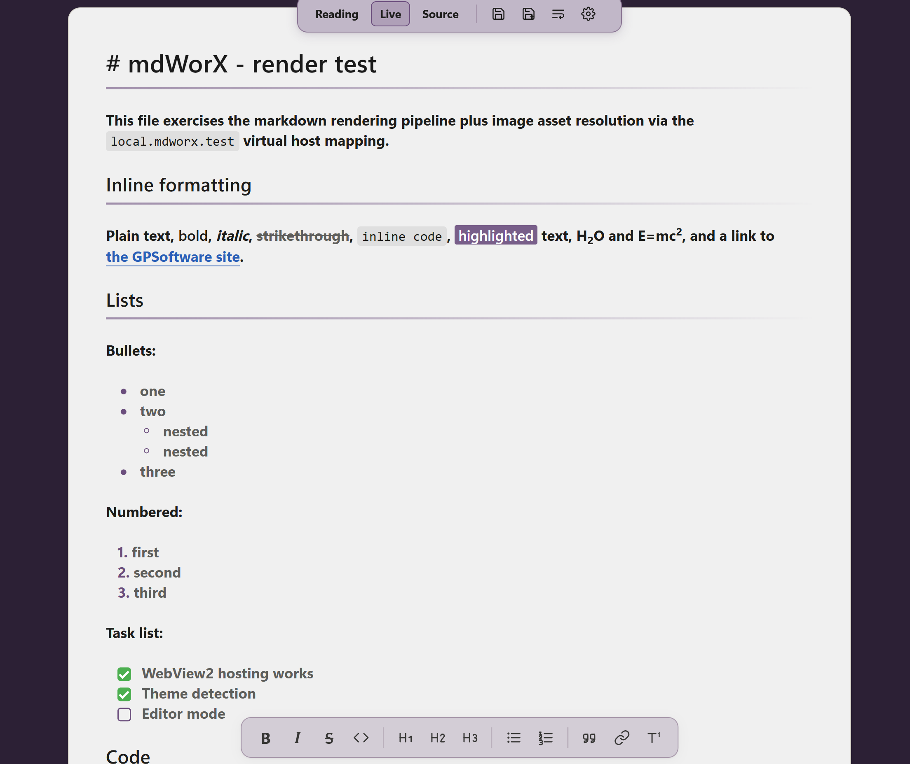
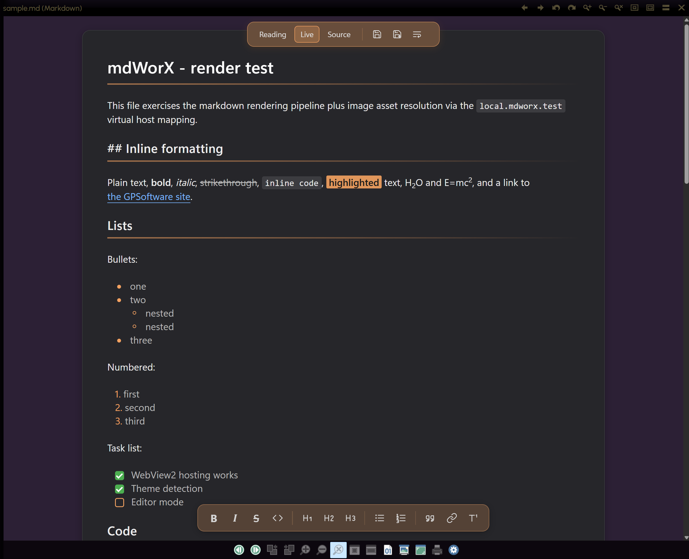

# mdWorX

A Markdown viewer and editor that runs inside Directory Opus, in the viewer pane or popped out into its own window.


I built this because I work with a lot of Markdown files day to day and didn't want to fire up another app every time I needed a small edit. The existing DOpus options kept throwing errors for me, partly because of a WebView2 DPI bug they don't work around, so I rolled my own. It's a solo project, shared in case it's useful to anyone else.

## How it works

There are three views:

- **Reading mode** for clean rendered HTML.
- **Live mode** where formatting stays visible until your cursor enters a line, at which point the raw markdown markers reveal themselves for that line only. Click somewhere else and they hide again.
- **Source mode** for raw Markdown. Click Source a second time to split the pane: raw on the left, live preview on the right, with a draggable handle in the middle and a link/unlink toggle for scroll syncing.


Double-click an `.md` file and the viewer pops out into its own window. Same modes, same split view, just without the DOpus chrome around it.


There's also a formatting toolbar at the bottom of the editor (bold, italic, strike, inline code, headings, bullet and numbered lists, quote, link, footnote) so you don't have to remember marker syntax.

## What it renders

GitHub-flavoured Markdown plus footnotes, definition lists, abbreviations, highlights (`==text==`), subscript (`H~2~O`), superscript (`E=mc^2^`), task lists, autolinks, and emoji shortcodes. Code blocks are syntax-highlighted and have a copy button in the corner that you click to copy the snippet (it flashes green to confirm). Footnotes at the bottom of the doc are editable in place: click the text and start typing.


## Encoding

Files that aren't UTF-8 still open cleanly. UTF-8 and UTF-16 (LE/BE) are detected from the file's header bytes automatically. For older codepages you pick the fallback in the settings: Shift-JIS for Japanese, GBK for Simplified Chinese, Big5 for Traditional Chinese, EUC-KR for Korean, CP1252 for Western European, or your system default. Right-to-left scripts (Arabic, Hebrew), joining scripts (Devanagari), and mixed scripts on the same line all render correctly. Saving writes back as UTF-8; if you opened a file in a legacy encoding, use Save As to keep the original.

The repo ships with [test fixtures](tests/encodings/) covering each script and encoding.

## Theming

Several theme presets are built in, and you can define your own. The accent colour you pick re-tints the toolbars, links, selection, syntax highlights, and scrollbars to match.

<p align="center">
  
  
</p>

## Install

1. Quit Directory Opus.
2. Download `mdWorX_vX.Y.zip` from the [Releases](../../releases) page and extract it anywhere.
3. Double-click `Install.cmd` and accept the UAC prompt.
4. DOpus relaunches and Markdown files open in mdWorX.

To remove it, double-click `Uninstall.cmd` from the same folder.

### Manual install

If you'd rather not run the script, extract the zip contents into `C:\Program Files\GPSoftware\Directory Opus\Viewers\` (admin rights needed). The end state is:

```
Viewers\mdWorX.dll
Viewers\mdWorX_assets\
```

## Requirements

- Windows 10 or 11, x64
- Directory Opus 12 or later, 64-bit
- Microsoft Edge WebView2 Runtime (preinstalled on Windows 11; [download for Windows 10](https://developer.microsoft.com/en-us/microsoft-edge/webview2/))

## Tips

- Switch modes from the centred top toolbar.
- Click Source again while already in Source mode to open the split view.
- The disk icons save the file. The icon next to them toggles word wrap on code blocks and long URLs.
- Click the copy button in the corner of any rendered code block to copy the snippet.
- In the viewer pane: save before clicking off to another file. If you switch files without saving, the pane reloads with the new selection and unsaved edits are gone. The pop-out window doesn't have this problem (you can edit, click around DOpus, come back, and click save).

## Building from source

```powershell
cd web
npm install
npm run build

cd ../plugin
.\build.ps1
```

The DLL ends up in `build-out\Release\` and the web assets in `build-out\mdWorX_assets\`. See [`docs/dev-setup.md`](docs/dev-setup.md) for the full toolchain setup, including the DOpus viewer plugin SDK.

## Licence

[MIT](LICENSE). © 2026 HyperWorX.
