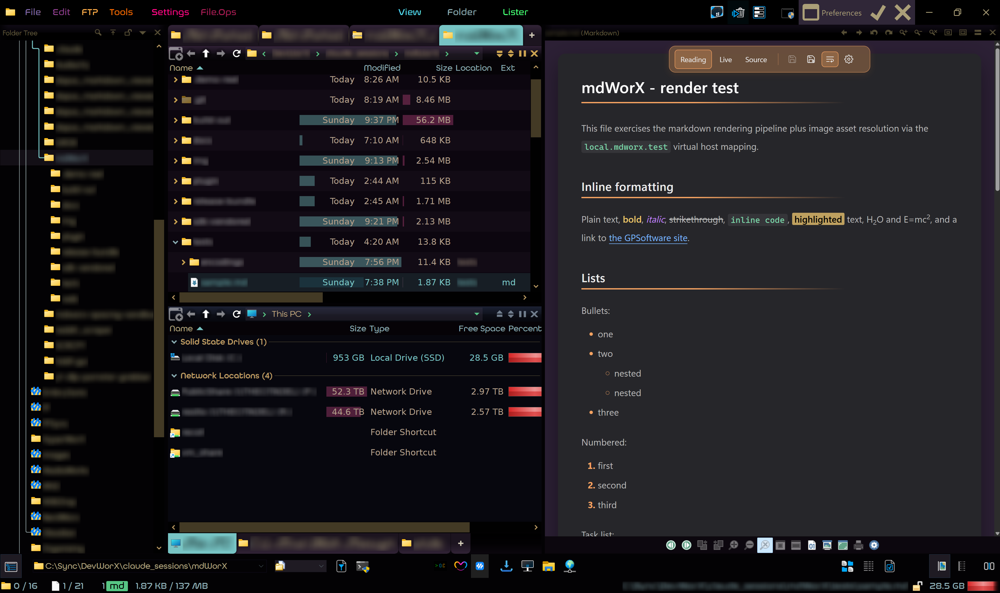
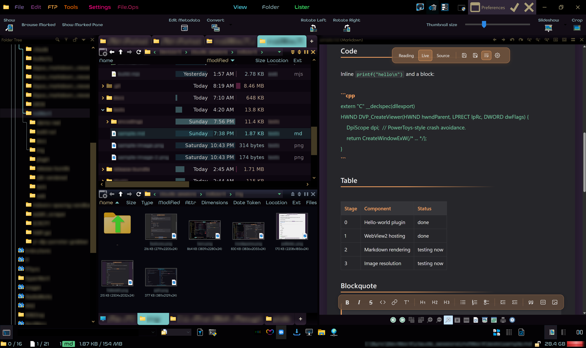
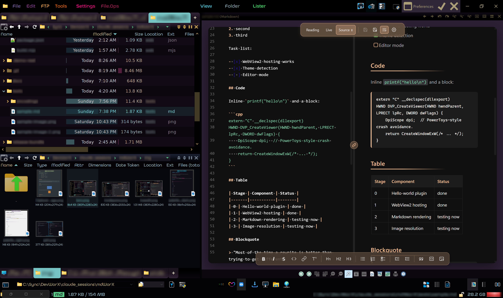
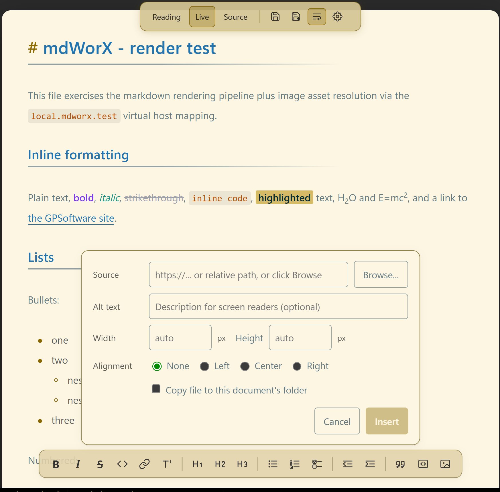
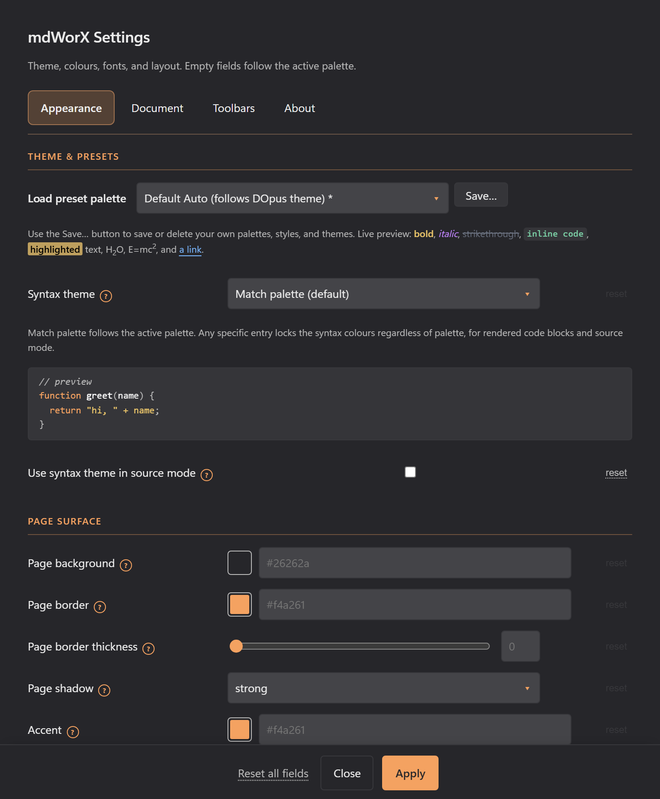
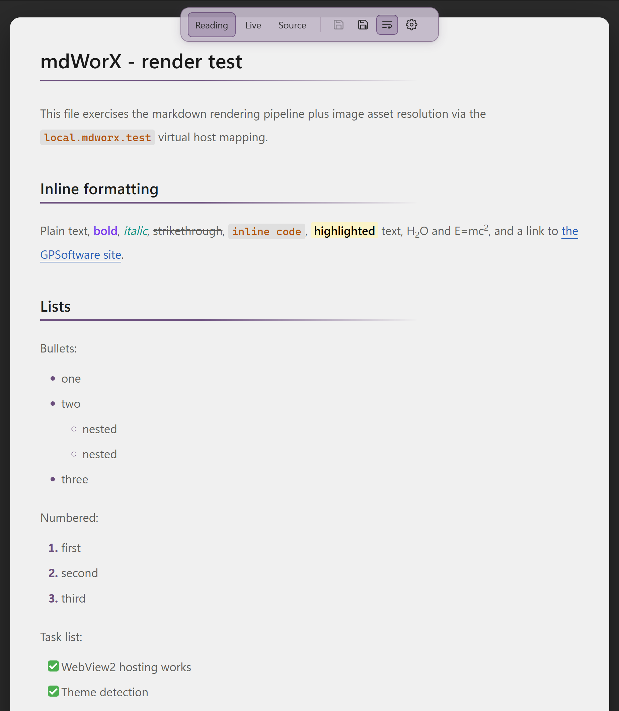
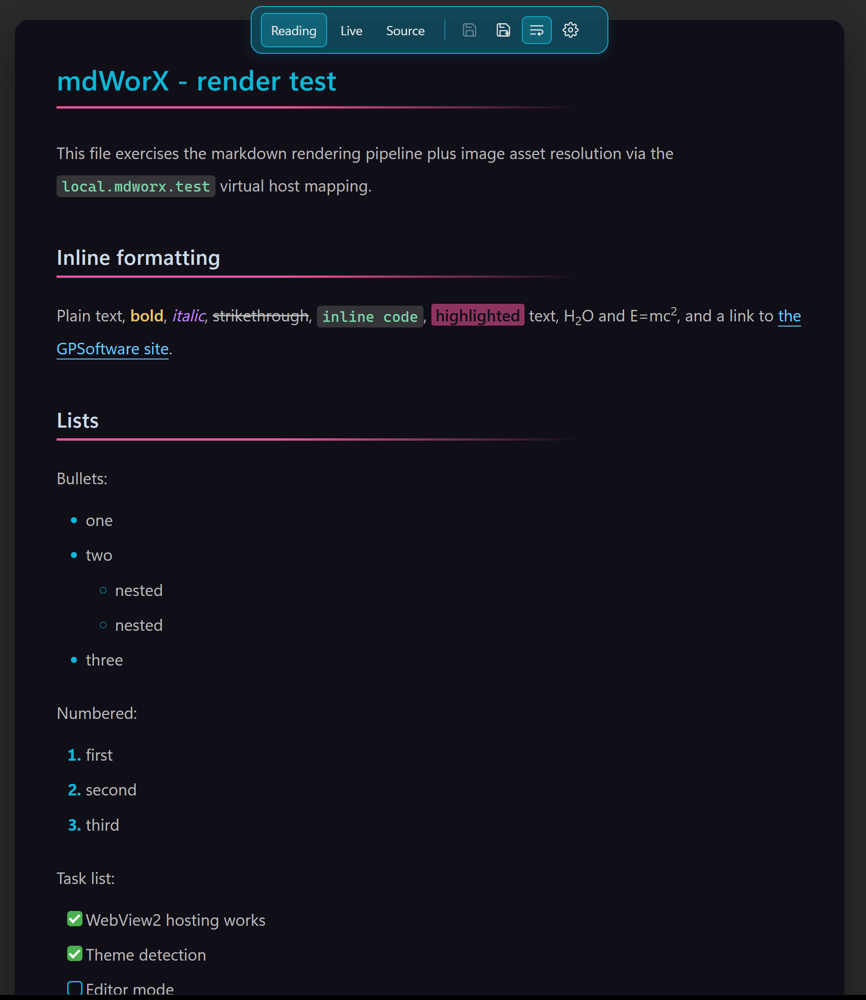

# mdWorX

A Markdown viewer and editor that runs inside Directory Opus, in the viewer pane or popped out into its own window.



I built this because I work with a lot of Markdown files day to day and didn't want to fire up another app every time I needed a small edit. The existing DOpus options kept throwing errors for me, partly because of a WebView2 DPI bug they don't work around, so I rolled my own. It's a solo project, shared in case it's useful to anyone else.

## How it works

There are three views, switched from the top toolbar:

- **Reading** for clean rendered HTML. The formatting toolbar is hidden in this mode.
- **Live** keeps the formatting visible until your cursor enters a line, at which point the raw markdown markers reveal themselves for that line only. Click somewhere else and they hide again.
- **Source** for raw Markdown. Click Source a second time to split the pane (see below).



Double-click an `.md` file and the viewer pops out into its own window. Same modes, same split view, just without the DOpus chrome around it. The pop-out window keeps unsaved edits if you switch focus to DOpus and come back; the in-pane viewer reloads when you click a different file, so save first.

### Split preview in Source mode

Click Source a second time while already in Source mode and the pane splits in two: raw markdown on the left, live-rendered preview on the right. Click Source a third time to close the split and return to single-pane Source.



- **Drag the centre handle** to resize the two panes. The split position is remembered for the session.
- **Linked scrolling is on by default.** Scrolling either side scrolls the other to the matching position, so the preview tracks the source as you write. The link icon sits in the middle of the split handle.
- **Click the link icon to unlink** the two panes. Each side then scrolls independently — handy when you want to read one section in the preview while editing somewhere else in the source. Click again to re-link; the panes resync from the active side.
- **Both panes use the same word-wrap setting.** Toggling word wrap in the top toolbar applies to source and preview together.
- **The editing toolbar stays available** at the bottom in split mode and acts on the source pane.

## Toolbars

**Top toolbar** (always visible):

- `Reading` / `Live` / `Source` mode buttons
- `Save` and `Save As`
- Word-wrap toggle for code blocks and long URLs
- Settings (opens the settings dialog)

**Editing toolbar** (visible in Live and Source modes):

- Bold, italic, strikethrough, inline code, link, footnote
- H1 / H2 / H3
- Bulleted list, numbered list, task list
- Outdent / indent
- Blockquote, fenced code block, image insert

The image button opens a small popup: pick a file with `Browse...` (or paste a URL or relative path), set alt text, optional width and height in px, and an alignment (none / left / centre / right). Tick **Copy file to this document's folder** and the picker copies the chosen file next to the markdown and inserts a relative path, so the document stays portable.



Image dimensions and alignment ride along in the alt-text using Obsidian-compatible syntax: `` for width, `` for width and height, `` for both plus alignment. Files rendered through this syntax round-trip with Obsidian and other editors that read it.

## What it renders

GitHub-flavoured Markdown plus footnotes, definition lists, abbreviations, highlights (`==text==`), subscript (`H~2~O`), superscript (`E=mc^2^`), task lists (clickable in Live mode), autolinks, and emoji shortcodes. Code blocks are syntax-highlighted by [Shiki](https://shiki.style) and have a copy button in the corner that flashes green to confirm. Footnote definitions at the bottom of the document are editable in place: click the text and start typing.

## Settings

The Settings dialog (gear icon in the top toolbar) covers everything visual without you having to hand-edit a JSON file.



Sections:

- **Theme & presets** — pick a preset palette, save the current colours as a named theme, or delete a saved theme you no longer want. Themes you save sit alongside the built-ins in the picker.
- **Document handling** — encoding, fallback encoding, "render single newlines as line breaks", and "show formatting characters in Live mode" (CRLF / LF badges at the end of each line).
- **Page surface** — page background, border colour and thickness, drop shadow, body text colour.
- **Headings** — per-level heading colours (H1 through H6).
- **Rules and dividers** — horizontal-rule colour and thickness, heading underline colour, thickness and style (`solid`, `gradient`, or `none`). Heading underline thickness is independent of HR thickness now, so you can have a thin rule and a chunky H1 underline (or the other way around).
- **Body text** — font family, weight, size, line-height.
- **Code** — code font, weight, size, line-height.
- **Inline accents** — bold, italic, strike, inline-code, highlight, link colours.
- **Layout** — content max-width and page padding.

Empty fields mean "use the theme default". `Reset all fields` blanks the form but doesn't save until you click `Apply`. Settings apply to every open viewer pane on save.

## Palettes

29 preset palettes ship with mdWorX: 17 dark, 12 light. The full visual reference is in [`docs/palettes.md`](docs/palettes.md) with side-by-side rendered samples.

| Light palette                                  | Dark palette                                 |
| ---------------------------------------------- | -------------------------------------------- |
|  |  |

Built-in dark: Default Dark, Dracula, Solarized Dark, Nord, Gruvbox Dark, One Dark, Tokyo Night, Ayu Dark, Catppuccin Mocha, GitHub Dark, Obsidianite, PLN Dark, AnuPpuccin Frappé, Everforest, Rosé Pine, Vesper, Red Rascal.

Built-in light: Default Light, PLN Light, Solarized Light, GitHub Light, Ayu Light, Gruvbox Light, Catppuccin Latte, One Light, Tokyo Night Day, Nord Light, Alucard, Obsidianite Light.

`Default Auto` follows the DOpus viewer-pane background and picks Default Dark or Default Light to match. Picking any preset re-tints toolbars, links, selection, syntax highlights, and scrollbars to fit.

## Encoding

Files that aren't UTF-8 still open cleanly. UTF-8 and UTF-16 (LE/BE) are detected from the file's header bytes automatically. For older codepages you pick the fallback in the settings: Shift-JIS for Japanese, GBK for Simplified Chinese, Big5 for Traditional Chinese, EUC-KR for Korean, CP1250 to CP1258 for the various European Windows codepages, ISO-8859-1/2/15, KOI8-R/U for Cyrillic, or your system default. Right-to-left scripts (Arabic, Hebrew), joining scripts (Devanagari), and mixed scripts on the same line all render correctly. Saving writes back as UTF-8; if you opened a file in a legacy encoding, use Save As to keep the original.

The repo ships with [test fixtures](tests/encodings/) covering each script and encoding.

## Install

1. Quit Directory Opus.
2. Download `mdWorX_vX.Y.Z.zip` from the [Releases](../../releases) page and extract it anywhere.
3. Double-click `Install.cmd` and accept the UAC prompt.
4. DOpus relaunches and Markdown files open in mdWorX.

To remove it, double-click `Uninstall.cmd` from the same folder.

### Manual install

If you'd rather not run the script, extract the zip contents into `C:\Program Files\GPSoftware\Directory Opus\Viewers\` (admin rights needed). The end state is:

```
Viewers\mdWorX.dll
Viewers\mdWorX_assets\
```

User settings live at `%APPDATA%\HyperWorX\mdWorX\settings.json`; saved custom themes live in `%APPDATA%\HyperWorX\mdWorX\themes\`. The DOpus uninstall script leaves your settings folder alone — delete it by hand if you want a clean wipe.

## Requirements

- Windows 10 or 11, x64
- Directory Opus 12 or later, 64-bit
- Microsoft Edge WebView2 Runtime (preinstalled on Windows 11; [download for Windows 10](https://developer.microsoft.com/en-us/microsoft-edge/webview2/))

## Tips

- In Source mode, click Source again to toggle the split preview. Drag the handle to resize; click the link icon in the middle of the handle to unlink scrolling.
- The disk icons save the file. The icon next to them toggles word wrap on code blocks and long URLs.
- Click the copy button in the corner of any rendered code block to copy the snippet.
- In the viewer pane: save before clicking off to another file. If you switch files without saving, the pane reloads with the new selection and unsaved edits are gone. The pop-out window doesn't have this problem (you can edit, click around DOpus, come back, and save).

## Building from source

```powershell
cd web
npm install
npm run build

cd ../plugin
.\build.ps1
```

The DLL ends up in `build-out\Release\` and the web assets in `build-out\mdWorX_assets\`. See [`docs/dev-setup.md`](docs/dev-setup.md) for the full toolchain setup, including the DOpus viewer plugin SDK.

## Licence

[MIT](LICENSE). © 2026 HyperWorX.
