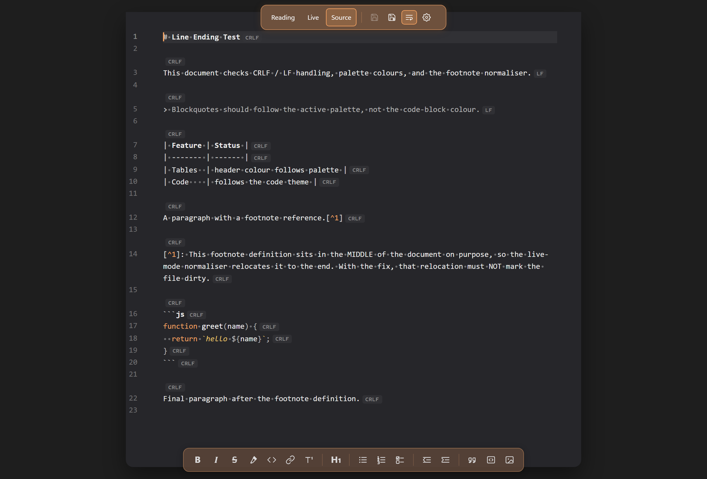
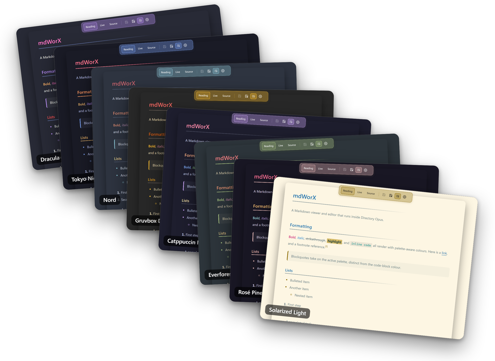

# mdWorX by HyperWorX

A Markdown viewer and editor that runs inside Directory Opus, in the viewer pane or popped out into its own window.


I built this because I work with a lot of Markdown files day to day and didn't want to fire up another app every time I needed a small edit. The existing DOpus options kept throwing errors for me, partly because of a WebView2 DPI bug they don't work around, so I rolled my own. It's a solo project, shared in case it's useful to anyone else.

<div align="center">

<a href="https://www.buymeacoffee.com/HyperWorX"></a>

</div>

## How it works

There are three views, switched from the top toolbar:

- **Reading** for clean rendered HTML. The formatting toolbar is hidden in this mode.
- **Live** keeps the formatting visible until your cursor enters a line, at which point the raw markdown markers reveal themselves for that line only. Click somewhere else and they hide again.
- **Source** for raw Markdown. Click Source a second time to split the pane (see below).


Double-click an `.md` file and the viewer pops out into its own window (you may need to point DOpus at its viewer for markdown first; see [Tips](#tips)). Same modes, same split view, just without the DOpus chrome around it. Keeps unsaved edits if you switch focus to another file in DOpus and come back.
### Split preview in Source mode

Source mode can split into two panes: raw markdown on the left, live-rendered preview on the right.


- **Click Source again to toggle the split.** A third click closes it and returns to single-pane Source.
- **Drag the centre handle** to resize the two panes. The split position is remembered for the session.
- **Linked scrolling is on by default.** Scrolling either side scrolls the other to the matching position, so the preview tracks the source as you write. The link icon sits in the middle of the split handle.
- **Click the link icon to unlink** the two panes. Each side then scrolls independently — handy when you want to read one section in the preview while editing somewhere else in the source. Click again to re-link; the panes resync from the active side.
- **Both panes use the same word-wrap setting.** Toggling word wrap in the top toolbar applies to source and preview together.
- **The editing toolbar stays available** at the bottom in split mode and acts on the source pane.

### Formatting marks

Turn on **Show formatting characters** (Settings, Document tab) to reveal an `LF` or `CRLF` badge at the end of every line, so a file with mixed line endings shows its actual mix at a glance. Live mode also marks spaces and tabs. mdWorX preserves each file's line endings on save, so a CRLF file stays CRLF.



## Toolbars

**Top toolbar** (always visible):

- `Reading` / `Live` / `Source` mode buttons
- `Save` and `Save As`
- Word-wrap toggle for code blocks and long URLs
- Settings (opens the settings dialog)

**Editing toolbar** (visible in Live and Source modes):

- Bold, italic, strikethrough, highlight, inline code, link, footnote
- One cycling Heading button (H1 through H6)
- Bulleted list, numbered list, task list
- Outdent / indent
- Blockquote, fenced code block, image insert

The image button opens a small popup: pick a file with `Browse...` (or paste a URL or relative path), set alt text, optional width and height in px, and an alignment (none / left / centre / right). Tick **Copy file to this document's folder** and the picker copies the chosen file next to the markdown and inserts a relative path, so the document stays portable. Paste an `http(s)` URL and the copy box auto-ticks — the image downloads into the document's folder and the saved syntax stays self-contained (no third-party host reference). The downloader sniffs the actual image type from magic bytes (PNG / JPEG / GIF / WebP / BMP / ICO / SVG / AVIF / HEIC), rejects responses that aren't valid images, and corrects the file extension if the URL lied about it.


Image dimensions and alignment ride along in the alt-text using Obsidian-compatible syntax: `` for width, `` for width and height, `` for both plus alignment. Files rendered through this syntax round-trip with Obsidian and other editors that read it.

## What it renders

GitHub-flavoured Markdown plus footnotes, definition lists, abbreviations, highlights (`==text==`), sub/superscript (`H~2~O`, `E=mc^2^`), task lists (clickable in Live), autolinks, and emoji shortcodes. Footnote definitions are editable in place. Code blocks get a copy button and [Lezer](https://lezer.codemirror.net/) syntax highlighting shared by the reading view and the source editor, so a palette switch re-tints both at once.

The Syntax theme picker sits beside the palette picker. `Match palette` (default) derives the nine token colours from the active palette, each bundled palette carrying its own set; pick a specific entry to lock them regardless of palette. By default it colours rendered code blocks only; tick **Use syntax theme in source mode** to include the Source editor.

## Settings

The Settings dialog (gear icon in the top toolbar) covers every visual option without you having to hand-edit a JSON file. Every field has a hover tooltip, the colour preview repaints live as you scroll through palettes, and the dialog itself follows whatever palette is active.


Empty fields mean "use the theme default" — leave a field blank and the active palette decides. `Reset all fields` blanks the form back to defaults, but nothing applies until you click `Apply`. Apply pushes the settings to every open viewer pane at once.

What it covers:

- **Theme and preset picker** — 29 built-in palettes (17 dark, 12 light — see [`docs/palettes.md`](docs/palettes.md) for the visual reference) plus any custom entries you've saved. Picker grouped Light / Dark / Your themes.
- **Save menu** — capture the current state three ways: **Save as palette** keeps just the colours, **Save as style** keeps just typography and layout (fonts, weights, sizes, line-heights, padding, max-width), **Save as theme** bundles everything. Saved entries appear in the picker alongside the built-ins; your own can be deleted, built-ins can't.
- **Document handling** — encoding (`auto`, `utf-8`, `utf-16` / `-le` / `-be`, `system`, the `cp1250`–`cp1258` family, ISO-8859 single-byte, Shift-JIS, GBK, Big5, EUC-KR, KOI8-R / -U), fallback encoding for when auto-detection fails, "render single newlines as line breaks" (hard line breaks), "show formatting characters" (an LF or CRLF badge at the end of every line in Live and Source modes, so a mixed-ending file shows its mix; Live mode also marks spaces and tabs), "allow remote images" (off by default — `` URLs render as a placeholder icon and no network request is made, so the hosting server can't learn the document was opened), "always reload external changes" (skips the conflict banner and always uses the disk version on file-return), and "auto-save every (minutes)" (0 disables; periodic save while the buffer is dirty).
- **Page surface** — background, border colour and thickness, drop-shadow depth (`none` through `floating`), body text colour.
- **Rules and dividers** — horizontal-rule colour and thickness, heading underline colour, thickness, and style (`solid`, `gradient`, or `none`). Heading underline thickness is independent of HR thickness, so a thin rule with a chunky H1 underline (or vice-versa) works fine. Default style is `gradient`.
- **Per-level heading colours** — H1 through H6, each independent.
- **Body and code typography** — font family, weight, size, line-height for body prose and for code blocks. Highlight font weight is its own field so `==marked==` text can be bolder than surrounding prose without affecting bold elsewhere.
- **Inline accents** — per-element colours for bold, italic, strikethrough, inline code, highlight (background plus foreground plus opacity), and links. Each follows the active palette by default; pin a specific colour to override.
- **Layout** — content max-width and page padding.

## Palettes

29 preset palettes ship with mdWorX: 17 dark, 12 light. Each one re-tints the whole document, the toolbars, and the syntax highlighting. The full visual reference is in [`docs/palettes.md`](docs/palettes.md) with side-by-side rendered samples.



Built-in dark: Default Dark, Dracula, Solarized Dark, Nord, Gruvbox Dark, One Dark, Tokyo Night, Ayu Dark, Catppuccin Mocha, GitHub Dark, Obsidianite, PLN Dark, AnuPpuccin Frappé, Everforest, Rosé Pine, Vesper, Red Rascal.

Built-in light: Default Light, PLN Light, Solarized Light, GitHub Light, Ayu Light, Gruvbox Light, Catppuccin Latte, One Light, Tokyo Night Day, Nord Light, Alucard, Obsidianite Light.

`Default Auto` follows the DOpus viewer-pane background and picks Default Dark or Default Light to match. Picking any preset re-tints toolbars, links, selection, syntax highlights, and scrollbars to fit.

## Encoding

Files that aren't UTF-8 still open cleanly. UTF-8 and UTF-16 (LE/BE) are detected from the file's header bytes automatically. For older codepages you pick the fallback in the settings: Shift-JIS for Japanese, GBK for Simplified Chinese, Big5 for Traditional Chinese, EUC-KR for Korean, CP1250 to CP1258 for the various European Windows codepages, ISO-8859-1/2/15, KOI8-R/U for Cyrillic, or your system default. Right-to-left scripts (Arabic, Hebrew), joining scripts (Devanagari), and mixed scripts on the same line all render correctly. Saving writes back as UTF-8; if you opened a file in a legacy encoding, use Save As to keep the original.

The repo ships with [test fixtures](tests/encodings/) covering each script and encoding.

## Install

1. Quit Directory Opus.
2. Download `mdWorX_vX.Y.Z.zip` from the [Releases](../../releases) page and extract it anywhere.
3. Double-click `Install.cmd` and accept the UAC prompt.
4. DOpus relaunches and Markdown files open in mdWorX.

To remove it, double-click `Uninstall.cmd` from the same folder.

### Manual install

If you'd rather not run the script, extract the zip contents into `C:\Program Files\GPSoftware\Directory Opus\Viewers\` (admin rights needed). The end state is:

```
Viewers\mdWorX.dll
Viewers\mdWorX_assets\
```

User settings live at `%APPDATA%\HyperWorX\mdWorX\settings.json`; saved custom themes live in `%APPDATA%\HyperWorX\mdWorX\themes\`. The DOpus uninstall script leaves your settings folder alone — delete it by hand if you want a clean wipe.

## Requirements

- Windows 10 or 11, x64
- Directory Opus 12 or later, 64-bit
- Microsoft Edge WebView2 Runtime (preinstalled on Windows 11; [download for Windows 10](https://developer.microsoft.com/en-us/microsoft-edge/webview2/))

## Tips

- **Make double-click open mdWorX.** By default DOpus opens a markdown file with whatever program Windows has it associated with. To open it in the mdWorX viewer window instead:
  1. In DOpus, go to **Settings → File Types**.
  2. Edit (or create) the Markdown file type covering `md, markdown, mdown, mdwn, mkd, mkdn`.
  3. Open the **Events** tab.
  4. Select **Left double-click**, click **Edit**, and set the command to just `Show`.

  This applies inside DOpus only. In Windows Explorer a double-click still uses the Windows default app, because mdWorX is a DOpus viewer plugin (a DLL), not a standalone program.
- The disk icons save the file. The icon next to them toggles word wrap on code blocks and long URLs.
- Click the copy button in the corner of any rendered code block to copy the snippet.
- Right-click rendered text in Reading mode for a copy menu.
- In the viewer pane: unsaved edits are stashed when you switch to another file. Click back and a banner asks whether to keep them or reload from disk. The stash lasts only for the current DOpus session and clears on save. Tick "Always reload external changes" in settings to skip the banner, or set an auto-save interval. Pop-out windows edit a single file and aren't affected.

## Building from source

```powershell
cd web
npm install
npm run build

cd ../plugin
.\build.ps1
```

The DLL ends up in `build-out\Release\` and the web assets in `build-out\mdWorX_assets\`. See [`docs/dev-setup.md`](docs/dev-setup.md) for the full toolchain setup, including the DOpus viewer plugin SDK.

---

<div align="center">

### Support

If you find this useful, you can buy me a coffee.

<a href="https://www.buymeacoffee.com/HyperWorX"></a>

</div>


## Licence

[MIT](LICENSE). © 2026 HyperWorX.
