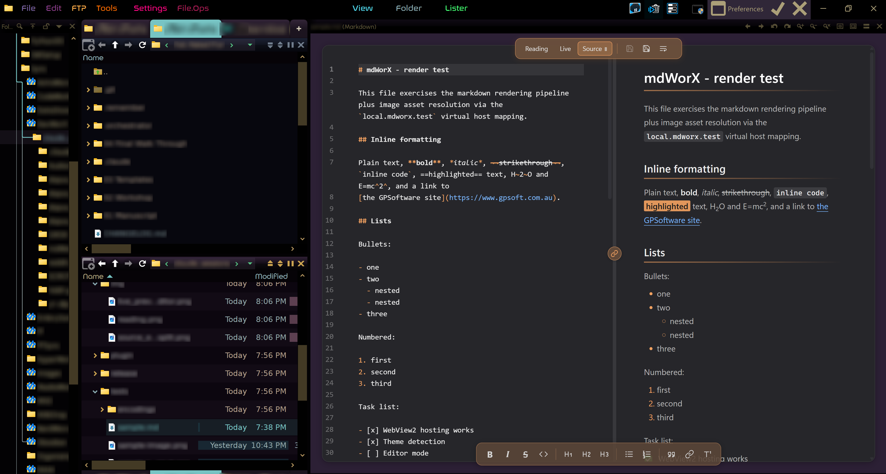
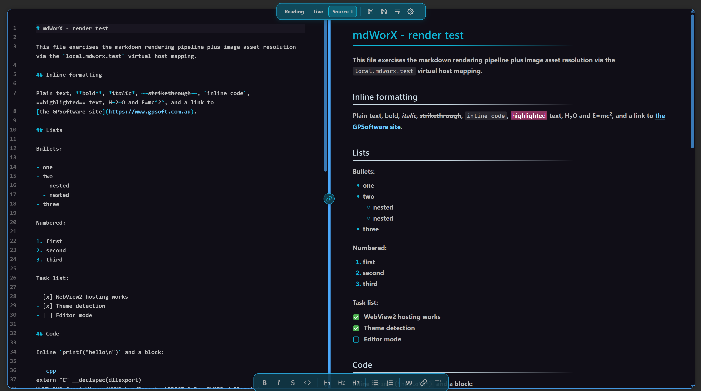
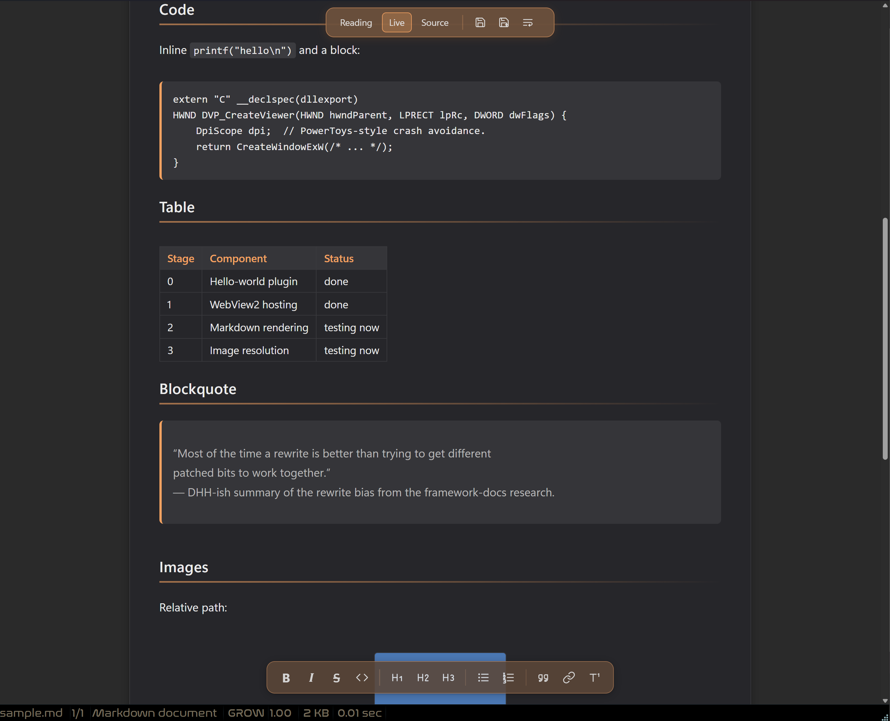

# mdWorX

> A small Markdown viewer and inline editor for **Directory Opus**. Live preview, split-screen source + render, palette-aware theming, and a few quality-of-life extras built on top.


## Why this exists

Markdown support inside Directory Opus has historically meant a passive shell-preview-handler bolted on from elsewhere (PowerToys, MarkDown Preview, etc.). They render HTML and that's it: no editing, no embedded images, and often broken on high-DPI displays. mdWorX is a small native DOpus viewer plugin that lets you actually edit `.md` files in the viewer pane without bouncing out to another app for every small change. It's not trying to replace Obsidian or Typora, just to fill the gap where DOpus had nothing usable.

---

## What's in it

- **Three view modes** — Reading, Live (Obsidian-style WYSIWYG), and Source.
- **Split-screen editing** in Source mode, with draggable resize and a toggleable scroll-link.
- **Inline and pop-out** — works in the DOpus viewer pane or in its own window.
- **A handful of themes** with a custom accent setting that re-tints the whole UI.
- **GFM markdown** plus footnotes, definition lists, abbreviations, mark/highlight, sub/sup.
- **Click-to-edit footnotes** at the bottom of the doc.
- **Real encoding support** — auto-detects UTF-8 / UTF-16 (LE/BE) via BOM, falls back to a configurable legacy codepage (CP1252, Shift-JIS, GBK, Big5, EUC-KR, system ANSI). Renders Arabic, Hebrew, CJK, Devanagari, Thai, Greek and mixed bidirectional content correctly via WebView2's full Unicode support.
- **Copy button on every code block** that hangs in the top-right corner and reveals on hover.
- **Word-wrap toggle** in the top toolbar — flip long code lines and URLs from horizontal-scroll to wrap.
- **Compact, scrollable toolbars** — the centred top toolbar (modes + save) and the bottom formatting toolbar both shrink to fit thin DOpus panes and scroll horizontally without showing scrollbars when they have to.
- **High-DPI workaround** so it doesn't fall over on scaled displays the way some handlers do.
- **One-click install** via a self-elevating script. No registry hacks, no runtime besides WebView2.

---

## Under the hood

mdWorX is a thin native C++ viewer plugin (Win32 + WebView2) wrapping a self-contained web layer:

- **CodeMirror 6 editor** with custom per-line decorator extensions that mimic Obsidian's "Live Preview" behaviour. Block formatting (headings, lists, blockquotes) renders unconditionally via `Decoration.line`; syntax markers (`#`, `>`, `-`, `*`) hide via `Decoration.replace({})` and reveal only on the active line. Architecturally a port of the atomic-editor pattern, with per-block decorators living in `web/src/livepreview/`.
- **markdown-it + DOMPurify** render pipeline for the Reading and split-preview panes, with `markdown-it-task-lists`, `-footnote`, `-deflist`, `-abbr`, `-mark`, `-sub`, `-sup` extensions wired in.
- **WebView2 host** via native COM (not the WinForms wrapper) to side-step the `ScaleHelper.EnterDpiAwarenessScope` crash that breaks PowerToys' preview handler on third-party file managers.
- **Palette-aware theming** using CSS `color-mix()` so any custom accent the user sets re-tints toolbar chrome, selection wash, syntax highlights, and scrollbar thumbs without per-palette CSS.
- **Virtual-host image resolution**: relative image paths get rewritten to `https://local.mdworx.test/...` and resolved by a `WebResourceRequested` handler scoped to the current file's parent directory.
- **DOpus viewer plugin SDK** integration (native `DVP_CreateViewer` etc.), so the plugin shows up in DOpus's normal viewer pipeline alongside built-in viewers, and inherits the lister pane's background colour via `DVPN_GETBGCOL`.

The architecture combination — DOpus viewer plugin + WebView2 + CodeMirror 6 + decorator-based live preview + split view — appears to be the first of its kind in the DOpus ecosystem.

---

## Features

### Three view modes

Switch between **Reading**, **Live**, and **Source** from the top toolbar.

- **Reading** — clean rendered HTML for reading.
- **Live** — Obsidian-style editing. Formatting stays visible until your cursor enters a line, at which point the raw markdown markers reveal themselves for that line only. Click somewhere else and they hide again.
- **Source** — raw Markdown with syntax highlighting.

### Split-screen editing

Click the Source button a second time and the pane splits: raw Markdown on the left, live rendered preview on the right.



- **Drag the middle handle** to resize each pane.
- **Link / unlink scrolling** via the small chain-link icon on the handle. When linked, scrolling either side keeps the other in step.

### Works in the pane *or* its own window

mdWorX lives inside the DOpus viewer pane, or you can pop it out into its own window (double-click). The windowed mode is the same editor with all the same modes and the split view, just without the DOpus chrome around it.

### Palette-aware theming

Light and dark theme out of the box; any custom accent colour re-tints the toolbars, selection, syntax highlights, links, and scrollbars to match.



### Configurable

A built-in settings UI for fonts, colours, page widths, line heights, accents, etc. Settings live alongside your other DOpus preferences as DOpus XML config.

### Markdown extensions

GitHub Flavored Markdown plus a useful collection of extras — code blocks (with syntax highlighting and a copy button on every block), tables, blockquotes, footnotes, definition lists, abbreviations, highlight (`==text==`), subscript (`H~2~O`), superscript (`E=mc^2^`), task lists, autolinks, and emoji shortcodes (`:smile:`).



### Encoding support

mdWorX detects file encoding properly instead of assuming UTF-8:

- **Auto-detect** via byte-order-mark sniffing for UTF-8 BOM, UTF-16 LE, and UTF-16 BE.
- **Strict UTF-8 validation** so a CP1252 file masquerading as UTF-8 doesn't silently render as garbage.
- **Configurable fallback codepage** when content isn't valid UTF-8 — system ANSI, **CP1252** (Western European), **Shift-JIS / CP932** (Japanese), **GBK / CP936** (Simplified Chinese), **Big5 / CP950** (Traditional Chinese), **EUC-KR / CP949** (Korean), or an explicit choice via the settings UI.
- **Full script rendering** for Arabic, Hebrew (with proper RTL bidi), Simplified and Traditional Chinese, Japanese, Korean, Devanagari (Hindi etc.), Thai, Greek, plus mixed bidirectional content. The Unicode heavy-lifting lives in WebView2 / Chromium so complex script shaping just works.
- **Save support** is currently UTF-8 and UTF-8-BOM only. Files in legacy codepages or UTF-16 are decoded and rendered correctly, but the save path will refuse to overwrite them in their original encoding for now. (Edit them and use Save As to write a UTF-8 copy.)

The repo ships with [test fixtures](tests/encodings/) covering each of these scripts and encodings so behaviour is verifiable.

### Other niceties

- Standard CodeMirror multi-cursor and editing behaviour.
- Save / Save As with dirty-state tracking.
- Copy button on every rendered code block (appears top-right on hover; flashes a green check on success).
- Word-wrap toggle in the top toolbar — toggles whether long code lines and URLs wrap to fit the pane or scroll horizontally inside their block.
- Toolbars hide their scrollbar UI and scroll horizontally with the mouse wheel when the pane is too narrow to fit every button.
- DOM-purified rendering so embedded HTML can't run untrusted scripts.

---

## Installation

### Quick install (recommended)

1. **Quit Directory Opus.**
2. Download the latest `mdWorX_vX.Y.zip` from the [Releases](../../releases) page.
3. Extract anywhere (Desktop is fine).
4. **Double-click `Install.cmd`** and accept the UAC prompt.
5. DOpus relaunches. Any `.md`, `.markdown`, `.mdown`, `.mkd`, `.mkdn`, or `.mdwn` file now opens in mdWorX.

### Manual install

If you'd rather not run the script:

1. Quit Directory Opus.
2. Extract the zip contents into `C:\Program Files\GPSoftware\Directory Opus\Viewers\` (admin rights needed).
3. End state should be:

    ```
    Viewers\mdWorX.dll
    Viewers\mdWorX_assets\
    ```

4. Relaunch DOpus.

### Uninstall

Double-click `Uninstall.cmd` from the extracted zip and accept the UAC prompt.

---

## Requirements

- **Windows 10 / 11** (x64)
- **Directory Opus 12** or later, 64-bit
- **Microsoft Edge WebView2 Runtime** — preinstalled on Windows 11; standalone installer for Windows 10 [here](https://developer.microsoft.com/en-us/microsoft-edge/webview2/)

---

## Tips

- **Switch modes** via the centred top toolbar (Reading / Live / Source).
- **Toggle split view** by clicking Source again while already in Source mode.
- **Save and Save As** are the disk icons in the same top toolbar; toggling **Word wrap** is the icon next to them.
- **Copy a code block** by hovering it — the circle button in the top-right corner copies the code to your clipboard.
- **Edit footnotes** in the rendered footnotes section at the bottom of the doc; click the body text and it becomes editable in place.
- **Heads up:** save before clicking off the file. Unsaved edits will be lost when DOpus loads a new selection.

---

## Building from source

```powershell
# 1. Build the web bundle (Node 20+, npm)
cd web
npm install
npm run build

# 2. Build the C++ plugin (Visual Studio 2022, CMake 3.20+)
cd ../plugin
.\build.ps1
```

DLL lands in `build-out\Release\`, web assets in `build-out\mdWorX_assets\`. See [`docs/dev-setup.md`](docs/dev-setup.md) for the full toolchain setup including the DOpus viewer plugin SDK requirement.

---

## Licence

[MIT](LICENSE). © 2026 HyperWorX.
